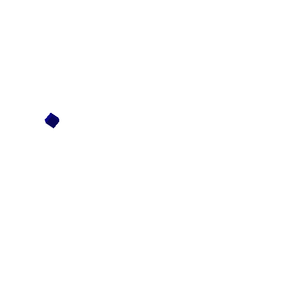
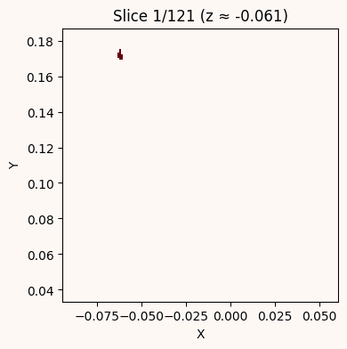

# VoxelViz

**Progressive Voxel-Based Visualization of 3D Models with Animated Build-Up**

VoxelViz converts 3D mesh models (OBJ, STL, PLY, etc.) into voxel representations and animates their construction in real time — block by block, layer by layer, or generatively — making 3D spatial structure intuitively understandable.

*Geometric Modelling 2025 · Vincent Jovian Christanto & Aryabima Mandala Putra*

---

## Demo

| Block-by-Block Drop | Layer Reveal |
|---|---|
|  |  |

---

## How It Works

1. **Load & watertight check** — Import any 3D mesh. If it has holes or gaps, the convex hull is used as a fallback to guarantee watertightness (required for solid voxelization).
2. **Voxelization** — Compute the AABB of the mesh, choose a voxel size (pitch), and run GPU-accelerated triangle-box overlap voxelization (Schwarz & Seidel, 2010) via `trimesh`. Output is a boolean occupancy grid `(nx × ny × nz)`.
3. **Color by Z-layer** — Sample a perceptually uniform colormap (`plasma` / `viridis`) per horizontal layer for visual clarity (inspired by Pandey et al., 2006).
4. **Animate** — Sort voxels bottom-up (Hedayati et al., 2019) and interpolate each cube falling from a fixed drop height to its final position. Frames are written to PNG then assembled into GIF + MP4.

Three ordering strategies are supported:

| Mode | Description |
|---|---|
| Block-by-block | Each voxel drops individually from above into its final position |
| Layer-by-layer | All voxels in a Z-slice are placed simultaneously |
| Generative | Randomised insertion order |

---

## Voxelization Methods Compared

| Method | Accuracy | Speed | GPU Ready | Notes |
|---|---|---|---|---|
| Triangle-Box Overlap | Supercover | Very Fast | Yes | No holes; slight overfill possible |
| Scanline | Angle-sensitive | Fast | Yes | Simple; misses tilted features |
| Octree-based | Adaptive | Fast | Yes | Memory-efficient; harder to implement |

---

## Files

| File | Description |
|---|---|
| `voxel_drop_animation.py` | Main script — voxelizes a mesh and renders the block-drop animation |
| `make_voxel_gif.py` | Assembles pre-rendered PNG slice frames into GIF / MP4 |
| `voxel_3d_animation.gif` | Demo: block-by-block drop (Stanford Bunny) |
| `voxel_animation.gif` | Demo: layer-reveal animation |
| `voxel_3d_animation_layer.mp4` | Demo: layer-by-layer MP4 |
| `voxel_3d_animation_generative.mp4` | Demo: generative ordering MP4 |

---

## Quick Start

```bash
pip install -r requirements.txt
```

Edit the parameters at the top of `voxel_drop_animation.py`:

```python
mesh_path   = "path/to/your_model.obj"
voxel_size  = 0.02   # smaller = higher fidelity, slower
output_gif  = "output/animation.gif"
output_mp4  = "output/animation.mp4"
```

Then run:

```bash
python voxel_drop_animation.py
```

---

## Requirements

- Python 3.9+
- trimesh
- numpy
- imageio + imageio-ffmpeg
- matplotlib

---

## References

- Zhang et al. (2017) — Scanline Voxelization  
- Schwarz & Seidel (2010) — Triangle-Box Overlap / GPU Conservative Rasterization  
- Li et al. (2014) — Wavefront planning for structural connectivity  
- Hedayati et al. (2019) — Discrete voxel sequencing (layer-wise / per-voxel insertion)  
- Pandey et al. (2006) — Slicing procedures and color-coded layer clarity  
